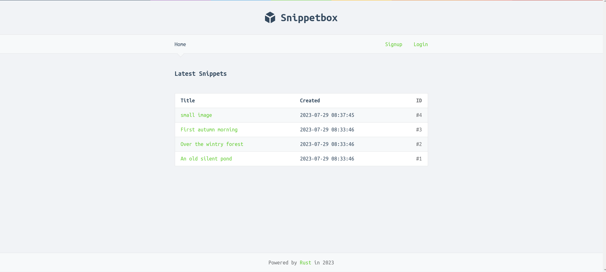
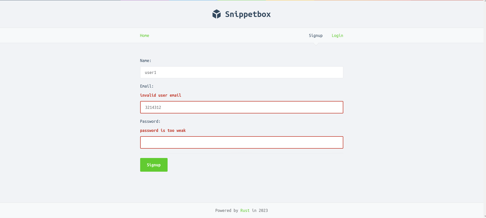
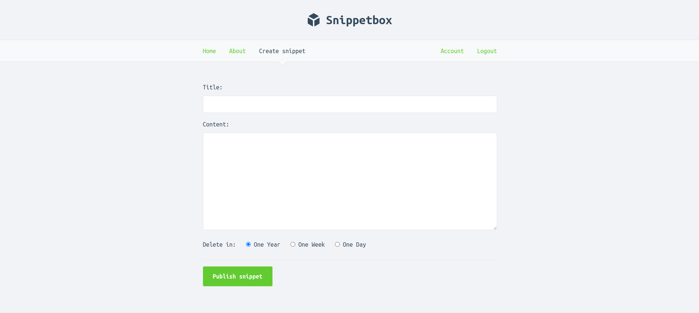

# snippetbox-rs -  snippetbox  in rust

I port the demo app "snippet box" in [Let's Go](https://lets-go.alexedwards.net/) to rust using [Actix web framework ](https://github.com/actix) and [Askama template rendering engine](https://github.com/djc/askama/) and [compile-time checked SQLx ](https://github.com/launchbadge/sqlx)


Learning  rust  web programming  from  [Zero To Production In Rust](https://github.com/LukeMathWalker/zero-to-production)   








## Building  && Running


### manual

```bash
./scripts/init_db.sh && ./scripts/init_redis.sh
```

```bash
 cargo run --release
```


### docker-compose

```bash
 docker-compose up -d
```
